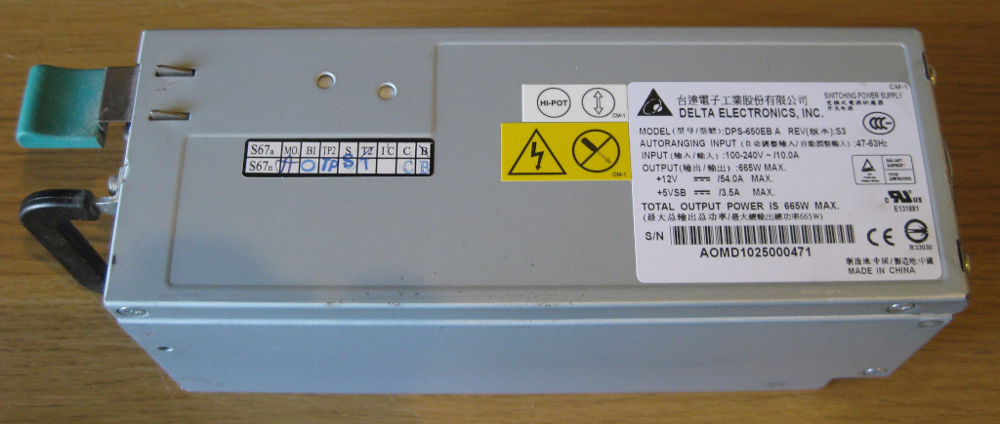
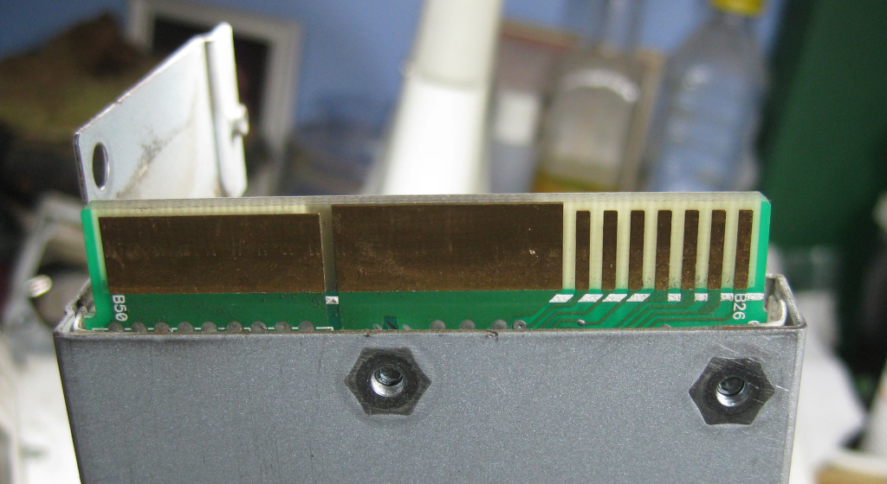
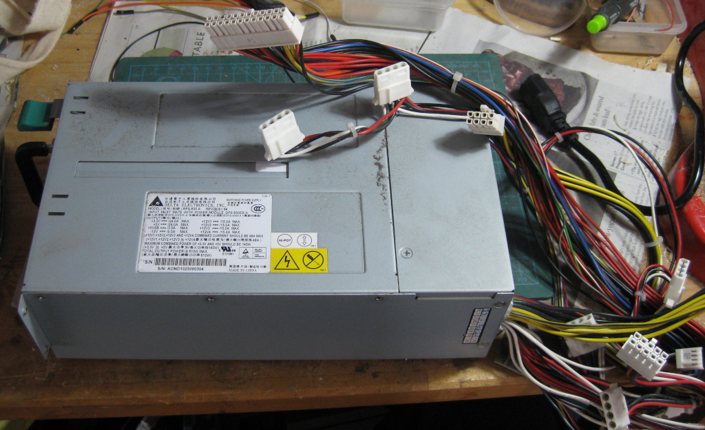
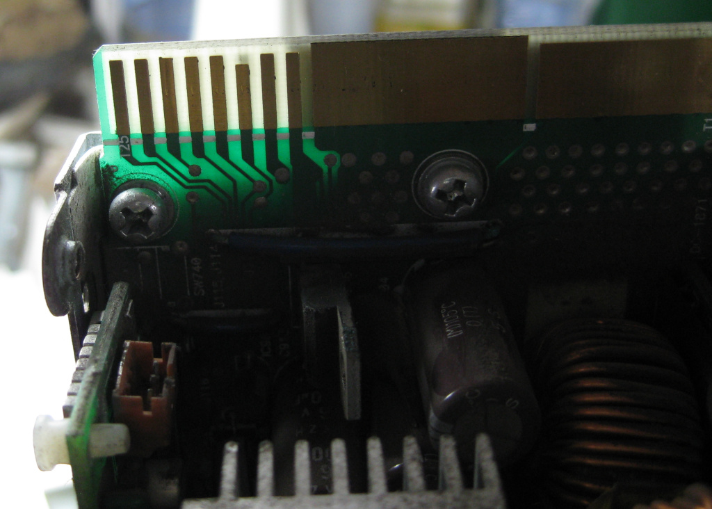
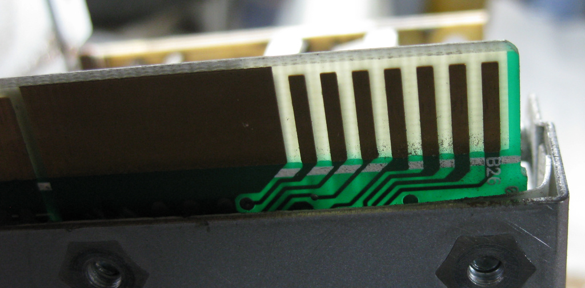
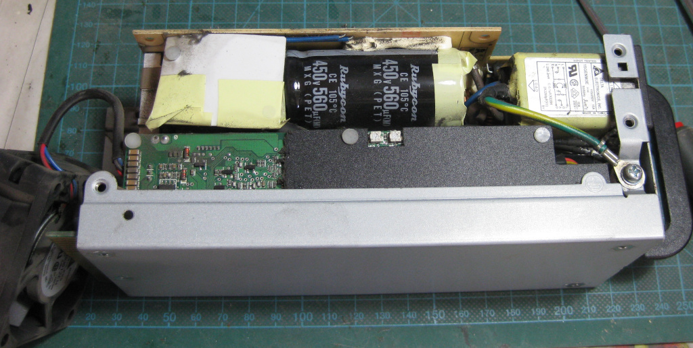

# Delta DSP-650EB PSU info

> **WARNING, DANGER OF DEATH**
>
> Note - if you are going to play around with mains powered switched mode power supplies, please
> only do so if you know what you are doing. By their nature, they rectify and store mains level
> voltages internally, so there is a strong chance there is >300v **DC** sat on some capacitors,
> even after you have powered them off and unplugged them. This can also be present on some of the
> naked internal metalwork, such as the heatsinks. This **can kill you**. Take note, and do this
> at your own risk.
>
> All information here is for information only. You have been warned!

I have a pair of Delta DPS-650EB server switch mode power supplies. These came as a pair in a 
Research Machines 'RM Dualserv', which is so old, and tbh, large and loud, it is no longer any use
to anybody. However, each of those PSUs can kick out a healthy 54A of 12v each, and that might be
of use to me.

I did some digging and tried to see if I could get the units to power up outside of the server.
Bottom line answer so far is **no**. I can however run them in the 'PSU chassis' that comes out of
the server, which might be a useful interim solution.

I'll document what I know here just in case it saves somebody else some time. If you know or find
out how to get these to power up on their own, drop a note here or email me and I'll update the
info.

## Overview

The RM Dualserv comes with dual redundant PSUs. They are quite compact, heavy, Delta switch mode
PSUs, each capable of delivering 12v at 54A as their main output. They are rated for 655W or
thereabouts.

At one end the unit has the 3pin IEC input connector and the 3 status LEDs. At the other is the
fan and the output edge connector.

The edge connector has the fairly normal double sided setup, with two large strips for the GND
and +12V (presumably), and 15 single 'pins' (7 on the bottom and 8 on the top, unusually).

## What I tried

Reading around (and if you are messing with this stuff, then you need to read the
[rcgroups posts](https://www.rcgroups.com/forums/showpost.php?p=11640787&postcount=7), there are
normally a couple of pins you need to ground to get similar units to boot. They will be PSON (to turn
the unit on), and PSKILL (which indicates if the unit is fitted to a server rack or not for instance).

Searching around the nearest 'equivalent' I could find was a reference to a 750XB unit, that has the
same number of pins and a similar 'look'. That unit appears to only have a PSON. Some details can
be found in the [relevant Intel manual](https://www.rcgroups.com/forums/showpost.php?p=11640787&postcount=7)
and also in [this useful post](https://www.rcgroups.com/forums/showpost.php?p=11640787&postcount=7).

However, testing around the pins with a 1kohm resistor to ground, and then a 330ohm resistor, and then
just a plain short produced no results, apart from I think I may have found the +5vsb line, as touching
that to ground with a short caused the PSU to go into a reset clicking cycle until I removed the link.

## What worked

Ultimately, searching around I found that the RM Dualserv was fitted with a Delta RPS-650 'cage', that
looks to transform the 650EB pinouts into a more standard 'ATX' style power supply:

That cage contains some reasonably complex extra 'gubbins', mostly I suspect as it needs to take
the 12v and convert it into +3v3 and +5v at 24A, so has a few extra reasonably chunky voltage
regulators in it. It also must contain the power on circuitry.

I put one of the 650EBs into the frame, and wired the green 'power on' line on the main ATX connector
to ground, and voila, out came 12v.

It's not clear to me if there is a more complex power up sequence required. Thoughts remaining are:

- Maybe the units need singalling over SMbus or similar - that would be a bit annoying, and unlike
  all other supplies I've read about being hacked.
- Maybe the 12v sense lines need to be wired up before the unit will boot - I don't think that is common
  on other supplies either is it?
- There may be more than one line that needs pulling high/low. Following the procedure on the RCgroups
  page linked earlier, where you test out all the lines and then wire 1kohm resistors across all the
  'worthy' ones and see if it powers up is probably worth a shot.

## Pinout

The 'pins' compose of edge connector pads on both sides. They are labelled partly on the PCB as
'T' and 'B' numbers - let's take those to be **T**op and **B**ottom. The labelling starts at T1-T25
and then continues back on the other side as B26-B50.

The below table tries to represent what I've found so far, which is not much:

| Pin | Function |
| --- | -------- |
| T1  | +12v |
| T2  | .. |
| T3  | .. |
| T4  | .. |
| T5  | .. |
| T6  | .. |
| T7  | .. |
| T8  | .. |
| T9  | GND |
| T11 | .. |
| T12 | .. |
| T13 | .. |
| T14 | .. |
| T15 | .. |
| T16 | .. |
| T17 | .. |
| T18 | +5sb ??? (shorting to GND resets PSU) |
| T19 | |
| T20 [short pin] | |
| T21 | Possibly fan control. 330ohm to T20 slows fan down, even when 12V not powered up |
| T22 | |
| T23 | |
| T24 | |
| T25 | |
| B26 | |
| B27 | |
| B28 | |
| B29 | |
| B31 | |
| B32 | |
| B33 | GND |
| B34 | .. |
| B35 | .. |
| B36 | .. |
| B37 | .. |
| B38 | .. |
| B39 | .. |
| B40 | .. |
| B41 | .. |
| B42 | +12v |
| B43 | .. |
| B44 | .. |
| B45 | .. |
| B46 | .. |
| B47 | .. |
| B48 | .. |
| B49 | .. |
| B50 | .. |

Note, as far as I can see there are *no* 'No Connection' (NC) pins on the header - here are some closeup
pictures:

## Ultimately 

These are *loud*. Even with no load, when powered up in the RPS-650, a single unit ran its fan up
to full speed, or so it seemed. Too loud for me to have living in my den/office. Maybe if I find a
need for a big PSU far far away (in the garage for instance), it might be workable.

For now the 650EBs and the RPS-650 are consigned to the 'may be useful in the future' pile.

If you do manage to get one of these powered up, inside you will find a couple of small potentiometers
that will probably allow you to alter the output voltage, if you need more than 12v. One of the
pots (I will bet the on on the RHS) will do that. The other alters the over current trip level I suspect.

